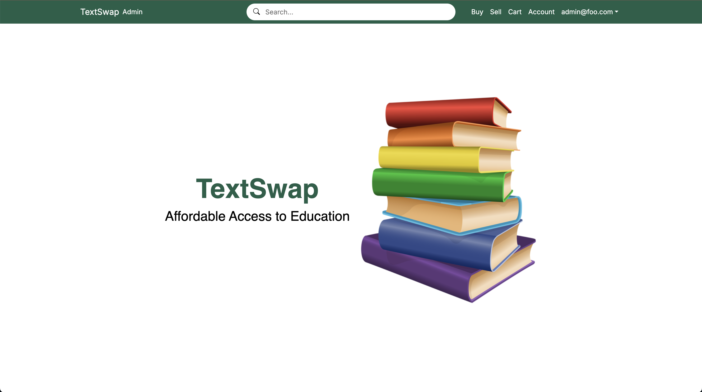
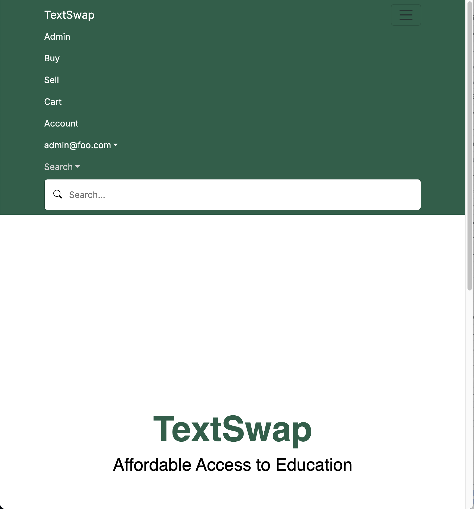
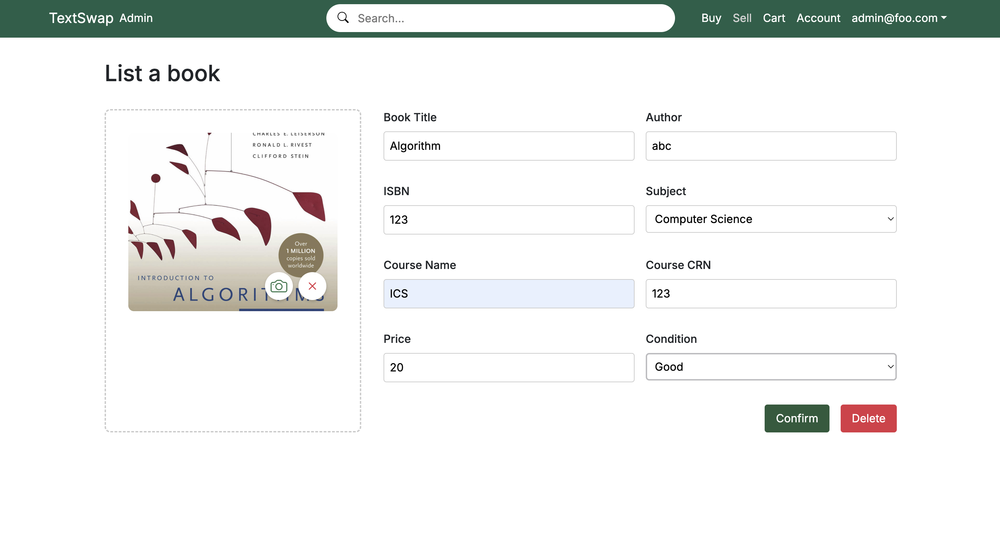
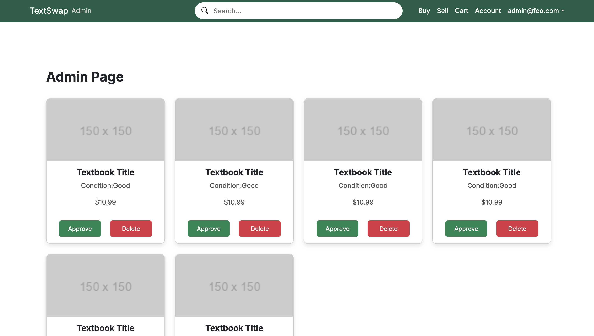

# Textswap

## Table of Contents

* [Overview](#overview)
* [Navbar](#navbar)
* [Buying and Selling](#buying-and-selling)
* [Team](#team)
* [Milestones](#milestones)

## Overview

Our goal for our site is to provide a place to buy and sell used textbooks, and allow users to upload their own listings or to view other listings. The website will also allow you to filter your searches and save textbooks to a cart. You can find our website [here!](https://manoa-textswap.vercel.app/)

## Navbar

The navbar would be a header at the top that would contain the tabs for seeing or creating listings, and of course the part where you sign in. It would be there to make the user interface more user friendly and would help to organize all of the different sections. 

### Sign in/Sign up

The sign in or sign up section would just be used to track users, and to ensure there aren't any issues you would have to sign up if you wanted to sell any textbooks on the site. 

### Tabs

The other tabs would be for buying textbooks or selling textbooks. The selling tab would let you make a listing that would be uploaded to the listings, and the buying tab would show you all of the listings. Both of these tabs are given more in depth descriptions in the following *"Buying and Selling"* section.

## Buying and Selling

The whole goal of the site is to buy and sell used textbooks to help other students. To make it more streamlined we would have two different tabs. One for making a listing, and one for commenting on listings. This is because it could be hard to figure out how to work the system if we didn't dedicate a section to the making of listings.

### Making a listing

The tab set up to make listings would allow you to specify the subject, title, price, and any other options that might be important descriptors for a textbook, like the condition or other important factors. 

## Milestones

We will post our goals and progress as milestones here. As we complete more milestones we will add more onto this section. In addition, you can find our repository [here.](https://github.com/Textswap/text_swap)

### Milestone 1

Our first goal is to get the basic skeleton of our project done. This is mainly just getting the landing page settled and if we have time adding other pages to the navbar. In addition, we need to deploy our code to Vercel. We would also like to work on branding aspects like getting a color scheme set and determining a logo.

### Milestone 2

Our goals with milestone 2 are to finish up the design of the website and finalize any creative decisions. In addition, we plan to finish up the skeleton of our website and start adding functionality to the mockups. Of course, full functionality of the site is still not likely in this milestone, several pages will presumably remain mockups for now.

### Milestone 3

Milestone 3 is of course the finish line. Our only real goals for this milestone is cleaning up any issues we have with our pages, adding in all of our data, find testers, and implement the acceptance testing. These being the finishing touches, and hopefully allowing us to have our website in full working order by the end. Project page [here.](https://github.com/orgs/Textswap/projects/8/views/1)

## Team

Textswap is maintained by Ellie Ishii, Xingyao He, Dhaniel Bolosan, and Logan Teachout.
