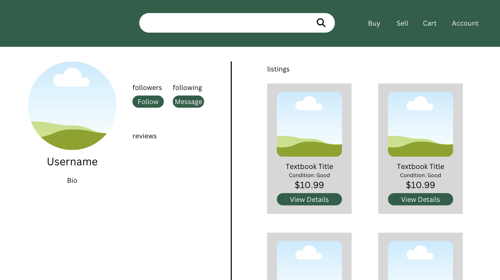
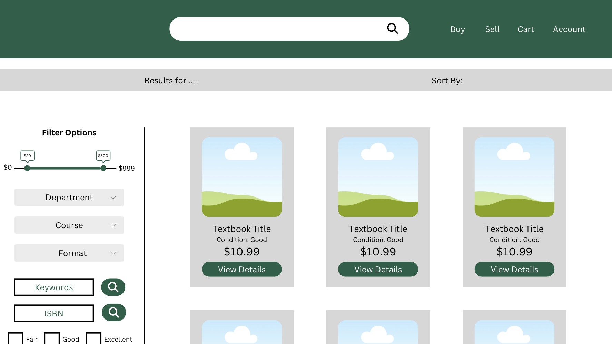
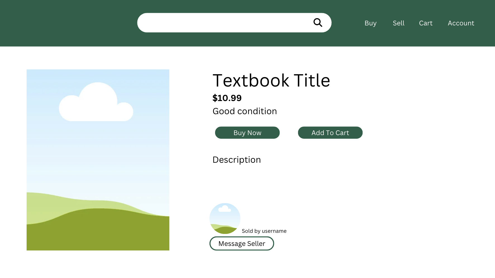
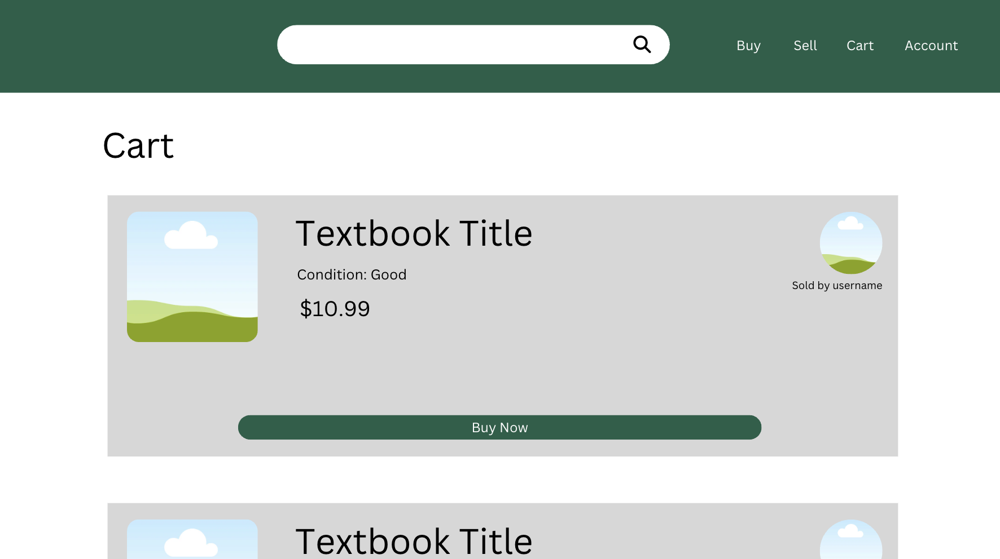
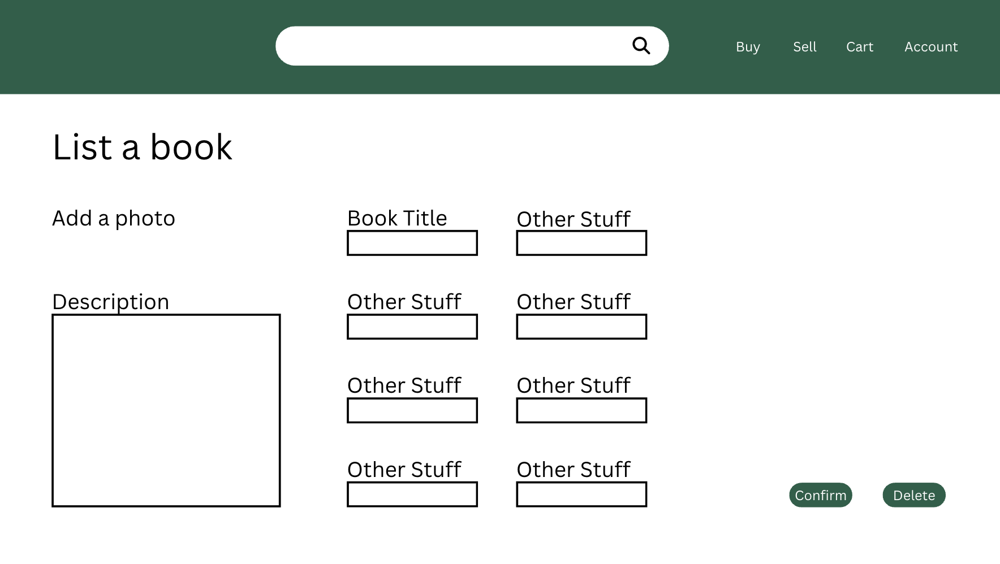
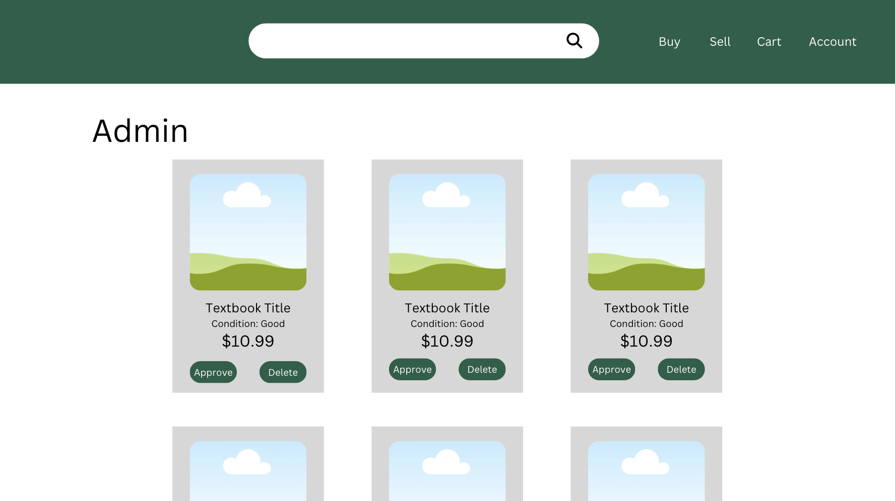

# Textswap

## Table of Contents

* [Overview](#overview)
* [Navbar](#navbar)
* [Buying and Selling](#buying-and-selling)
* [Team](#team)
* Milestone 1: https://github.com/orgs/Textswap/projects/3/views/1

## Overview

Our goal for our site is to provide a place to buy and sell used textbooks, and allow users to upload their own listings or to view other listings. We also intend to let people comment on listings. The process would essentially work as a set of listings that you could comment on, and once an agreement is made you could move onto purchasing it from the person through the desired means.

## Navbar

The navbar would be a header at the top that would contain the tabs for seeing or creating listings, and of course the part where you sign in. It would be there to make the user interface more user friendly and would help to organize all of the different sections. 

### Sign in/Sign up

The sign in or sign up section would just be used to track users, and to ensure there aren't any issues you would have to sign up if you wanted to sell any textbooks on the site. 

### Tabs

The other tabs would be for buying textbooks or selling textbooks. The selling tab would let you make a listing that would be uploaded to the listings, and the buying tab would show you all of the listings. Both of these tabs are given more in depth descriptions in the following *"Buying and Selling"* section.

## Buying and Selling

  

  

The whole goal of the site is to buy and sell used textbooks to help other students. To make it more streamlined we would have two different tabs. One for making a listing, and one for commenting on listings. This is because it could be hard to figure out how to work the system if we didn't dedicate a section to the making of listings.

### Making a listing

The tab set up to make listings would allow you to specify the subject, title, price, and any other options that might be important descriptors for a textbook, like the condition. Then, it would allow you to set a description where you would add any other notes. This would be things such as the price, or if you're looking for an exchange, or even details like notes scribbled in the margins of the textbook.

### Commenting on a listing

The tab for sorting through listings would also be where you purchase the textbooks. You could filter the different listings by the specifications listed above such as condition, price, subject, and title. Then, via the ability to comment on posts you could contact the seller and attempt to make a deal with them. This would allow for haggling, or for getting more specific details from the owner of the textbook. Then, once something is settled you could work out the method of payment and how you would recieve the textbook.

## Team

Textswap is maintained by Ellie Ishii, Xingyao He, Dhaniel Bolosan, and Logan Teachout.

